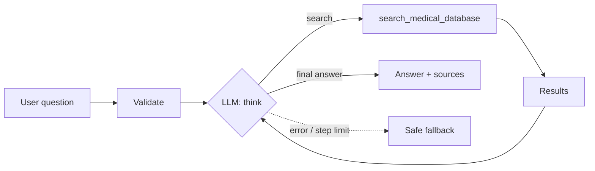

# Healthcare Q&A Agent

A small agent that answers health questions by searching the web and summarizing
what it finds, along with the sources it used. It's written as a plain ReAct loop
(think → search → read → answer) so the reasoning is easy to follow.

You can run it two ways: completely offline with no API key (a mock model plus
saved search results), or with a free Groq key for a real LLM and live web search.

A full write-up with the architecture diagram, screenshots, and sample runs is in
[docs/Agent_Run_Report.pdf](docs/Agent_Run_Report.pdf).

## Why this design

**Domain — healthcare Q&A.** It's a good fit for an agent because it actually has
to decide what to look up, call a tool, read the results, and then answer based on
them rather than from memory.

**Search tool.** I used DuckDuckGo (the `ddgs` library) as a free stand-in for
PubMed. The real PubMed API needs keys, rate limits, and XML parsing, none of
which is the point of this exercise. The search function simply prefixes the
query with "medical clinical" to bias results toward health sources.

**No framework.** The loop is hand-written (about 40 lines). Since the main
deliverable is the reasoning trace, I wanted to own that loop instead of hiding it
inside something like LangChain. On each turn the model returns a small JSON
object (a thought plus an action), which I validate with Pydantic.

**Technique — RAG.** The agent doesn't answer from memory; it answers from what
the search returns and cites the links.

## How it works



Each turn the model emits one JSON step (`thought` + `action`). A `search` action
runs the tool and feeds the results back; the loop ends when the model returns a
final answer, or when it hits the step limit.

## Project layout

```
src/
  agent.py         the ReAct loop, input checks, CLI, fallback
  llm.py           talks to the model (groq / openai / anthropic / mock)
  prompts.py       system prompt + one example
  schemas.py       Pydantic models for each step
  trace.py         logs the reasoning to console + JSONL
  config.py        reads settings from .env
  tools/search.py  the search tool (+ offline fixtures)
evaluate.py        runs the test scenarios
tests/scenarios.json
data/fixtures/     saved results so it works offline
app.py             Streamlit UI
```

## Setup

```bash
pip3 install -r requirements.txt
cp .env.example .env
```

## Running it

Offline, no key needed:

```bash
LLM_PROVIDER=mock SEARCH_OFFLINE=true \
  python3 -m src.agent --domain healthcare \
  --query "What are the treatment options for Type 2 diabetes?"
```

With a free Groq key (real model + live search). Get a key at
https://console.groq.com/keys, put it in `.env`:

```ini
LLM_PROVIDER=groq
GROQ_API_KEY=your-key-here
LLM_MODEL=llama-3.3-70b-versatile
SEARCH_OFFLINE=false
```

then:

```bash
python3 -m src.agent --domain healthcare --query "How is asthma treated long term?"
```

Web UI:

```bash
python3 -m streamlit run app.py
```

## Evaluation

```bash
LLM_PROVIDER=mock SEARCH_OFFLINE=true python3 evaluate.py --scenarios tests/scenarios.json
```

Five scenarios (three medical topics, one input-validation check, one
unknown-topic fallback). It prints a pass/fail line for each and a final score.
Expected: 5/5.

## Configuration

Everything is set through `.env` (see `.env.example`):

| Variable | What it does | Default |
|---|---|---|
| `LLM_PROVIDER` | `groq`, `openai`, `anthropic`, or `mock` | `mock` |
| `LLM_MODEL` | model name | `gpt-4o-mini` |
| `LLM_TEMPERATURE` | sampling temperature | `0.1` |
| `AGENT_MAX_STEPS` | max think/search cycles | `5` |
| `SEARCH_MAX_RESULTS` | results per search | `3` |
| `SEARCH_OFFLINE` | use saved results instead of the web | `false` |

## Handling things that go wrong

- The model call retries with backoff and times out; if it keeps failing the
  agent returns a safe fallback answer instead of crashing.
- If the web search fails, the tool quietly uses the saved fixtures.
- Empty or very long questions are rejected up front, and a step limit stops the
  loop from running forever.
- Every step is logged to the console and saved under `traces/`.

> Educational demo only, not a substitute for professional medical advice.
