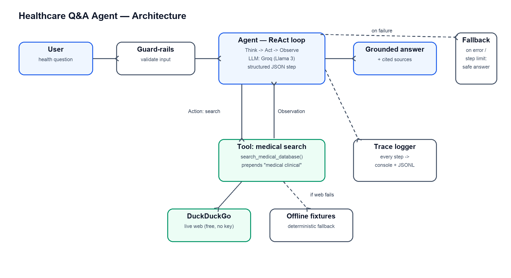
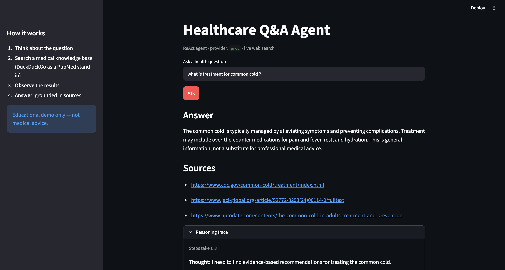
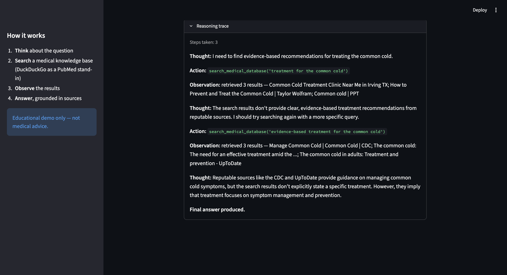
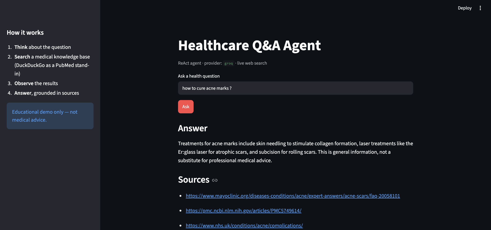
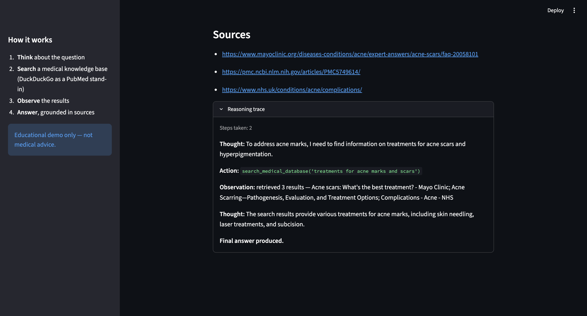

# Agent Run Report — Healthcare Q&A Agent

**Live demo:** https://healthcare-agent-fo48sgeutc25uy2ogrqpk6.streamlit.app/

This is a short walkthrough of what I built, how it thinks, and how it behaves
when you actually run it. The goal of the project was a small, honest agent that
answers health questions by looking things up and summarizing what it finds —
not a giant framework, and nothing that needs servers to run.

---

## 1. What it does, in one line

You ask a health question, the agent searches a medical knowledge base, reads
the results, and writes back a short answer with the sources it used.

I picked the **healthcare Q&A** domain because it shows the whole agent story
clearly: it has to decide *what* to look up, actually call a tool, read the
results, and then ground its answer in them.

---

## 2. Architecture



The flow is a classic **ReAct loop** (Reason → Act → Observe), which is just a
fancy way of describing how a person researches something:

1. **Guard-rails** — first we sanity-check the question (not empty, not absurdly
   long) before spending any tokens.
2. **Agent (the LLM)** — at each turn the model returns one small JSON step: a
   *thought* plus an *action*. The action is either "search" or "give the final
   answer".
3. **Tool: medical search** — when the agent chooses to search, we call
   `search_medical_database()`. It uses DuckDuckGo (free, no API key) as a
   stand-in for a real clinical database like PubMed, and quietly steers the
   query toward medical sources by prefixing it with "medical clinical".
4. **Observation** — the top results (title, snippet, link) go back to the agent.
5. The loop repeats until the agent is confident, then it writes a
   **grounded answer with cited sources**.

Two things sit off to the side and make it robust:

- **Trace logger** records every step (thought, tool call, observation, answer)
  to the console and to a JSONL file, so the reasoning is always inspectable.
- **Fallback** — if the LLM errors out, or the agent runs out of steps, it
  returns a safe, honest answer instead of crashing. Likewise, if the web search
  ever fails, the tool transparently falls back to bundled offline fixtures.

### Why these choices

- **Free + zero infra:** Groq's free tier runs Llama 3 for the LLM, and
  DuckDuckGo is free for search. Nothing to deploy, no paid keys required.
- **Custom loop instead of a framework:** the deliverable *is* the reasoning
  trace, so I kept the loop small and readable rather than hiding it inside
  LangChain. It's about 40 lines and easy to follow.
- **Structured JSON every step:** each step is validated with Pydantic, which
  keeps parsing clean and the trace uniform.

---

## 3. The app in action

A simple Streamlit UI wraps the same agent. Here are real runs (Groq + live
DuckDuckGo search).

### Example A — "What is the treatment for the common cold?"

The agent answers and lists the sources it actually used (CDC, UpToDate, etc.):



What I like about this run is the reasoning trace below — the agent's **first
search returned weak results, so it noticed that and searched again with a
better query** before answering. That self-correction is the agent genuinely
reasoning, not just doing one canned lookup:



### Example B — "How to cure acne marks?"

A different topic, same clean behavior — grounded answer plus Mayo Clinic, NIH,
and NHS sources:





---

## 4. A full reasoning trace (text)

Same common-cold run as above, captured from the terminal. This is the exact
"reasoning chain + tool calls + final output" the assignment asks for:

```
[QUERY] what is treatment for common cold?

[THOUGHT]  I need to find evidence-based recommendations for treating the common cold.
[ACTION]   search_medical_database('treatment for the common cold')
[OBSERVE]  3 results — "Common Cold Treatment Clinic..."; "How to Prevent and Treat
           the Common Cold"; "Common cold | PPT"

[THOUGHT]  These results aren't from reputable sources. I should search again with a
           more specific query.
[ACTION]   search_medical_database('evidence-based treatment for the common cold')
[OBSERVE]  3 results — "Manage Common Cold | CDC"; "The common cold: the need for an
           effective treatment..."; "The common cold in adults: Treatment - UpToDate"

[THOUGHT]  Reputable sources (CDC, UpToDate) point to symptom management and prevention.
[ANSWER]   The common cold is typically managed by alleviating symptoms and preventing
           complications — over-the-counter pain/fever medicine, rest, and hydration.
           This is general information, not a substitute for professional medical advice.
[SOURCES]  cdc.gov/common-cold/treatment, jaci-global.org/..., uptodate.com/...
```

---

## 5. Evaluation

I wrote 5 test scenarios in `tests/scenarios.json` and a small runner
(`evaluate.py`) that checks each answer against simple expectations. It runs
fully offline (mock LLM + fixtures), so results are deterministic.

| # | Scenario | What it checks | Result |
|---|----------|----------------|--------|
| 1 | Type 2 diabetes treatment | answer mentions `metformin`, cites sources | PASS |
| 2 | First-line hypertension therapy | mentions a first-line drug class | PASS |
| 3 | Asthma long-term treatment | mentions `corticosteroid` | PASS |
| 4 | Empty query | guard-rail rejects the input | PASS |
| 5 | Unknown topic | falls back to general trusted sources | PASS |

**Score: 5/5.**

Run it yourself:

```
LLM_PROVIDER=mock SEARCH_OFFLINE=true python3 evaluate.py --scenarios tests/scenarios.json
```

---

## 6. Design decisions & trade-offs

- **DuckDuckGo instead of PubMed.** PubMed's API means XML parsing and rate
  limits. DuckDuckGo gives me the same engineering (tool call, observation
  handling) for free. Trade-off: lower medical authority — acceptable, since the
  assignment values the engineering over perfect medical accuracy.
- **Custom ReAct over LangChain.** Smaller, clearer, no dependency churn, and the
  reasoning trace is fully mine to show. Trade-off: I don't get framework
  features like built-in memory for free — fine for this scope.
- **A deterministic mock LLM + offline fixtures.** This lets the whole project
  (and the evaluation) run with no key and no network. Trade-off: the mock isn't
  a real model, but it exercises the exact same agent code path, and swapping in
  Groq is one env-var change.
- **Degrade gracefully everywhere.** LLM errors → retry then fallback; search
  failure → fixtures; too many steps → safe answer. The agent should never just
  crash on the user.

---

## 7. How to run it

```
pip3 install -r requirements.txt
cp .env.example .env          # add your free Groq key from console.groq.com/keys

# Ask a question (Groq + live web search):
python3 -m src.agent --domain healthcare --query "What are the treatment options for Type 2 diabetes?"

# Or launch the UI:
python3 -m streamlit run app.py
```

> Educational demo only — not a substitute for professional medical advice.
